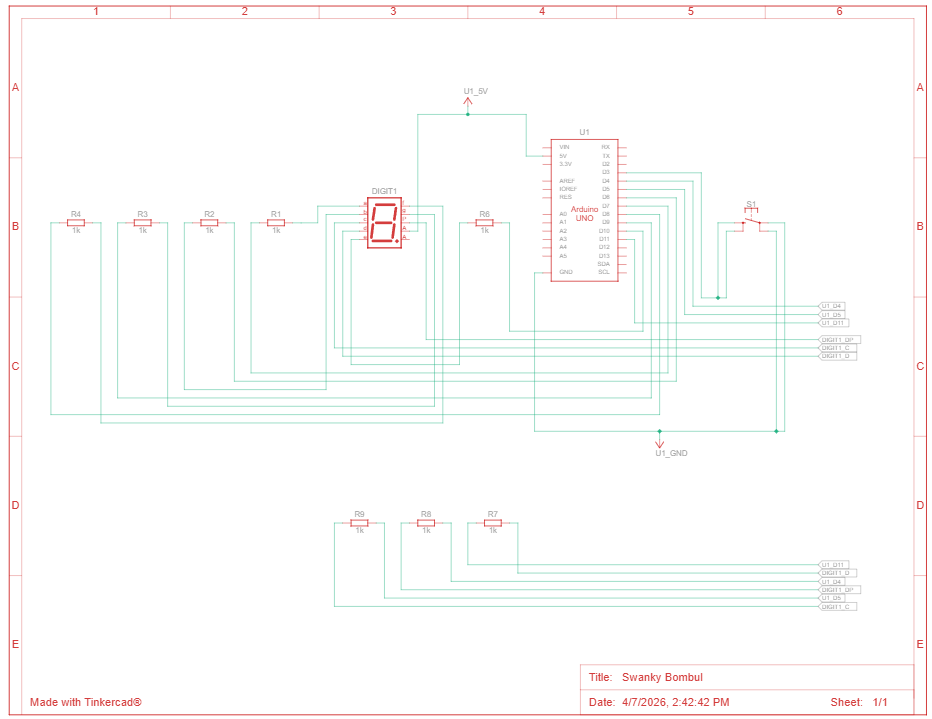
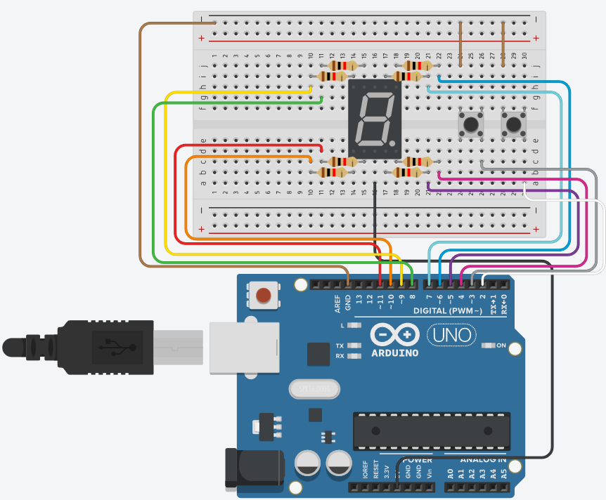

# Pertanyaan Push Button

## 1. Gambarkan rangkaian schematic yang digunakan pada percobaan!

Berikut rangkaian schematic yang digunakan pada percobaan:



## 2. Mengapa pada push button digunakan mode `INPUT_PULLUP` pada Arduino Uno? Apa keuntungannya dibandingkan rangkaian biasa?

Mode INPUT_PULLUP digunakan karena pin input Arduino akan diberi resistor pull-up internal, sehingga saat tombol tidak ditekan nilainya menjadi `HIGH` dan saat tombol ditekan nilainya menjadi `LOW`.

Keuntungannya dibanding rangkaian biasa:
- tidak perlu resistor pull-up eksternal,
- rangkaian lebih sederhana dan hemat komponen,
- wiring lebih rapi dan mudah dirakit.

## 3. Jika salah satu LED segmen tidak menyala, apa saja kemungkinan penyebabnya dari sisi hardware maupun software?

Beberapa kemungkinan penyebab dari sisi hardware, seperti LED segmen rusak atau putus, kabel menuju segmen tidak terhubung dengan baik, resistor pembatas arus bermasalah, pin Arduino yang dipakai untuk segmen tertentu rusak, common pin seven segment tidak tersambung dengan benar, tipe seven segment tidak sesuai dengan konfigurasi rangkaian.

Kemungkinan penyebab dari sisi software, seperti pin pada array segmentPins salah urut, pola pada digitPattern salah, logika aktif-high/aktif-low tidak sesuai dengan jenis seven segment, pin belum diset sebagai OUTPUT, ada kesalahan pada fungsi displayDigit().

## 4. Modifikasi rangkaian dan program dengan dua push button yang berfungsi sebagai penambahan (`increment`) dan pengurangan (`decrement`) pada sistem counter dan berikan penjelasan disetiap baris kode nya.



```cpp

// pin
const int segmentPins[8] = {7, 6, 5, 11, 10, 8, 9, 4}; // urutan pin untuk a, b, c, d, e, f, g, dp.

// dua tombol increment dan decrement
const int btnUp = 3;
const int btnDown = 2;

byte digitPattern[16][8] = {
  {1,1,1,1,1,1,0,0}, // 0
  {0,1,1,0,0,0,0,0}, // 1
  {1,1,0,1,1,0,1,0}, // 2
  {1,1,1,1,0,0,1,0}, // 3
  {0,1,1,0,0,1,1,0}, // 4
  {1,0,1,1,0,1,1,0}, // 5
  {1,0,1,1,1,1,1,0}, // 6
  {1,1,1,0,0,0,0,0}, // 7
  {1,1,1,1,1,1,1,0}, // 8
  {1,1,1,1,0,1,1,0}, // 9
  {1,1,1,0,1,1,1,0}, // A
  {0,0,1,1,1,1,1,0}, // b
  {1,0,0,1,1,1,0,0}, // C
  {0,1,1,1,1,0,1,0}, // d
  {1,0,0,1,1,1,1,0}, // E
  {1,0,0,0,1,1,1,0}  // F
};

// menyimpan nilai digit yang sedang ditampilkan.
int currentDigit = 0;

// state sebelumnya untuk mendeteksi tekan tombol pada transisi HIGH ke LOW.
bool lastUpState = HIGH;
bool lastDownState = HIGH;

// menampilkan digit sesuai variabel input
void displayDigit(int num)
{

  for(int i = 0; i < 8; i++)
  {
    digitalWrite(segmentPins[i], !digitPattern[num][i]);
  }
}

void setup()
{
  for(int i = 0; i < 8; i++)
  {
    pinMode(segmentPins[i], OUTPUT);
  }

  pinMode(btnUp, INPUT_PULLUP);
  pinMode(btnDown, INPUT_PULLUP);

  displayDigit(currentDigit);
}

// main loop
void loop()
{
  bool upState = digitalRead(btnUp);
  bool downState = digitalRead(btnDown);

  // increment (btn up)
  if(lastUpState == HIGH && upState == LOW)
  {
    currentDigit++;
    if(currentDigit > 15) currentDigit = 0;
    displayDigit(currentDigit);
  }

  // decrement (btn down)
  if(lastDownState == HIGH && downState == LOW)
  {
    currentDigit--;
    if(currentDigit < 0) currentDigit = 15;
    displayDigit(currentDigit);
  }

  // menyimpan state tombol untuk yang berikutnya
  lastUpState = upState;
  lastDownState = downState;
}
```

Dengan rangkaian ini, saat tombol ditekan input akan membaca `LOW`, lalu counter akan bertambah atau berkurang sesuai tombol yang ditekan.
