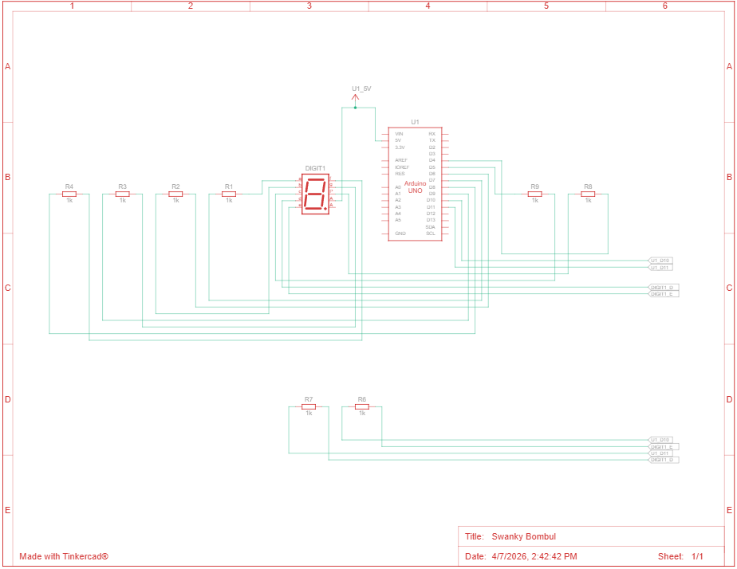
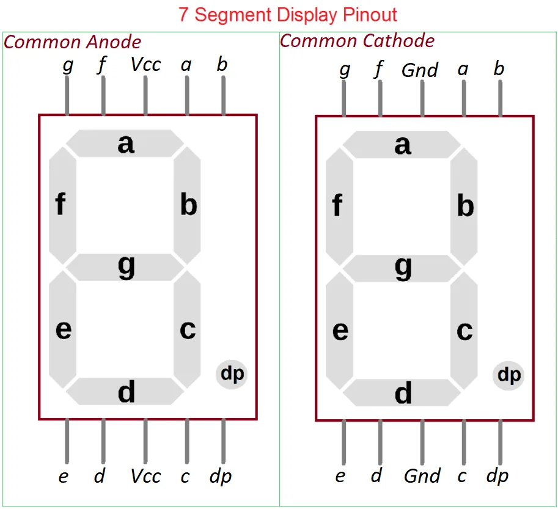

# Pertanyaan Seven Segment

## 1. Gambarkan rangkaian schematic yang digunakan pada percobaan!

Berikut rangkaian schematic yang digunakan pada percobaan:



## 2. Apa yang terjadi jika nilai `num` lebih dari 15?

Jika nilai num lebih dari 15, program akan mengakses array `digitPattern[num][i]` di luar batas indeks yang tersedia. Karena array hanya punya indeks `0` sampai `15`, kondisi ini bisa menyebabkan tampilan seven segment menjadi acak atau program error atau hang.

## 3. Apakah program ini menggunakan common cathode atau common anode? Jelaskan alasanya!

Program ini menggunakan common anode.



Bisa dilihat pada gambar pinout diatas, yang digunakan adalah common anode karena menggunakan pin 5v(vcc). Selain itu pada array `digitPattern`, nilai `1` berarti segmen harus menyala. Tetapi saat dikirim ke pin, program memakai `digitalWrite(segmentPins[i], !digitPattern[num][i]);`. Artinya, ketika pattern bernilai `1`, output pin menjadi `LOW`.

Penggunaan logika terbalik pada program menunjukkan bahwa rangkaian yang dipakai adalah common anode.

## 4. Modifikasi program agar tampilan berjalan dari F ke 0

Keseluruhan program masih sama seperti sebelumnya, tapi pada bagian loop() ada yang berubah. Sebelumnya program akan menampilkan dari 0 ke F, tapi karena sekarang diminta berjalan dari F ke 0 yang itu berkebalikan. Makanya iterasi pada loop() dibuat menjadi mundur.

```cpp
// mapping pin segment
const int segmentPins[8] = {7, 6, 5, 11, 10, 8, 9, 4}; //a b c d e f g dp

byte digitPattern[16][8] = {

{1,1,1,1,1,1,0,0}, //0
{0,1,1,0,0,0,0,0}, //1
{1,1,0,1,1,0,1,0}, //2
{1,1,1,1,0,0,1,0}, //3
{0,1,1,0,0,1,1,0}, //4
{1,0,1,1,0,1,1,0}, //5
{1,0,1,1,1,1,1,0}, //6
{1,1,1,0,0,0,0,0}, //7
{1,1,1,1,1,1,1,0}, //8
{1,1,1,1,0,1,1,0}, //9
{1,1,1,0,1,1,1,0}, //A
{0,0,1,1,1,1,1,0}, //b
{1,0,0,1,1,1,0,0}, //C
{0,1,1,1,1,0,1,0}, //d
{1,0,0,1,1,1,1,0}, //E
{1,0,0,0,1,1,1,0}  //F
};

// menampilkan digit digit sesuai variabel input (num)
void displayDigit(int num)
{
  for(int i=0;i<8;i++)
  {
    digitalWrite(segmentPins[i], !digitPattern[num][i]);
  }
}

void setup()
{
  for(int i=0;i<8;i++)
  {
    pinMode(segmentPins[i], OUTPUT);
  }
}

// iterasi ini yang membuat tampilan dimulai dari digitpattern 15 atau (F) lalu turun sampai 0. dengan delay setiap digit 1 detik.
void loop()
{
  for(int i=15;i>=0;i--)
{
  displayDigit(i);
  delay(1000);
}
}

```
