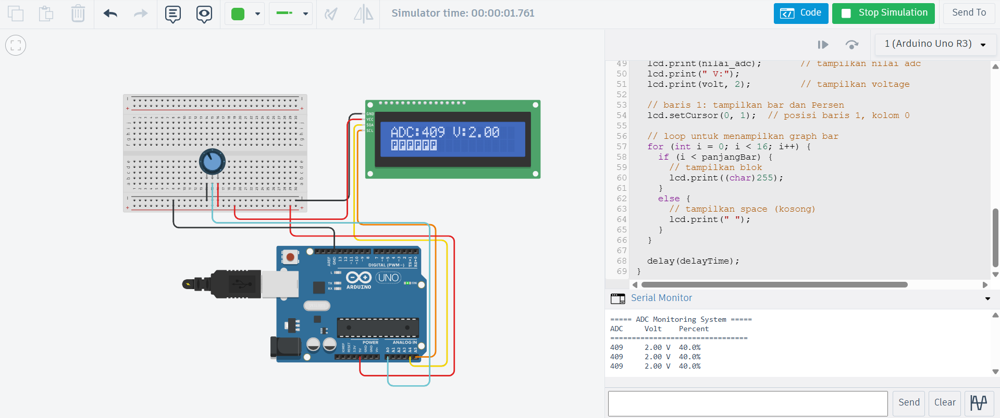

## 1. Jelaskan Bagaimana Cara Kerja Komunikasi I2C Antara Arduino dan LCD

**I2C (Inter-Integrated Circuit)** adalah protokol komunikasi serial 2-line, dimana SDA (Serial Data) berguna untuk transmisi data, SCL (Serial Clock) berguna untuk sinkronisasi waktu

**Cara Kerja:**
Arduino sebagai master (mengontrol), dan LCD sebagai slave (penerima). Setiap device mempunyai alamat unik (0x27). Master mengirim alamat dan data melalui library LiquidCrystal_I2C, slave kirim ACK (acknowledge). Proses berulang sampai semua data terkirim

**Keuntungan vs Serial:** Hanya 2 kabel (4+ untuk UART), bisa multiple devices dengan alamat berbeda, jarak hingga beberapa meter

---

## 2. Apakah Pin Potensiometer Harus Seperti Itu?

Konfigurasi yang benar adalah Pin Kiri (GND) → Pin Tengah (A0) → Pin Kanan (VCC 5V). Pin potensiometer harus terhubung dari ground ke power supply melalui pin analog agar memberikan range tegangan 0-5V penuh untuk ADC. Dengan konfigurasi ini, ketika potensiometer diputar ke kiri, ADC akan membaca nilai 0, dan ketika diputar ke kanan, ADC akan membaca nilai 1023. Arah pembacaan ini akan sesuai dengan ekspektasi pengguna.

Jika pin kiri dan kanan tertukar (VCC → A0 → GND), pembacaan ADC akan terbaca terbalik. Potensiometer yang diputar ke kiri akan menghasilkan ADC 1023, sedangkan diputar ke kanan menghasilkan ADC 0. Meskipun ADC masih membaca dalam range 0-1023 dan tegangan tetap 0-5V, arah kontrolnya menjadi kebalikan dan dapat membingungkan pengguna.

---

## 3. Modifikasi Program: Gabungan UART dan I2C

```cpp
#include <Wire.h>
#include <LiquidCrystal_I2C.h>

// Inisialisasi LCD I2C dengan alamat 0x27, ukuran 16x2
LiquidCrystal_I2C lcd(0x27, 16, 2);

const int pinPot = A0;      // pin analog untuk potensio
const float maxVoltage = 5.0;  // tegangan referensi arduino (5V)
const int maxADC = 1023;    // nilai ADC maksimal (10-bit)

// delay untuk debounce dan refresh rate
const int delayTime = 200;

void setup() {
  // inisialisasi komunikasi serial dengan baud rate 9600
  Serial.begin(9600);
  
  lcd.init();          // Inisialisasi LCD
  lcd.backlight();     // Nyalakan backlight
  
  // print header pada serial monitor saat startup
  Serial.println("===== ADC Monitoring System =====");
  Serial.println("ADC\tVolt\tPercent");
  Serial.println("================================");
}

void loop() {
  
  int nilai_adc = analogRead(pinPot);  // baca nilai ADC (0-1023) 

  float volt = (nilai_adc / (float)maxADC) * maxVoltage; // convert adc ke volt   
  float persen = (nilai_adc / (float)maxADC) * 100.0; // convert adc ke percentage
  int panjangBar = map(nilai_adc, 0, maxADC, 0, 16); // mapping adc ke panjang bar

  // output ke serial monitor
  Serial.print(nilai_adc);
  Serial.print("\t");
  
  Serial.print(volt, 2);  // 2 desimal
  Serial.print(" V\t");
  
  Serial.print(persen, 1); // 1 desimal
  Serial.println("%");
  
  // output ke lcd
  // baris 0: tampilkan adc dan volt
  lcd.setCursor(0, 0);  // posisi baris 0, kolom 0
  lcd.print("ADC:");
  lcd.print(nilai_adc);       // tampilkan nilai adc
  lcd.print(" V:");
  lcd.print(volt, 2);         // tampilkan voltage
  
  // baris 1: tampilkan bar dan Persen
  lcd.setCursor(0, 1);  // posisi baris 1, kolom 0
  
  // loop untuk menampilkan graph bar
  for (int i = 0; i < 16; i++) {
    if (i < panjangBar) {
      // tampilkan blok
      lcd.print((char)255);
    }
    else {
      // tampilkan space (kosong)
      lcd.print(" ");
    }
  }
  
  delay(delayTime);
}
```

---

## 4. Lengkapi Tabel ADC, Volt, dan Persen

### Formula Konversi:

| ADC | Volt (V) | Persen (%) |
|-----|----------|-----------|
| 1   | 0.005    | 0.1       |
| 21  | 0.103    | 2       |
| 49  | 0.239    | 4       |
| 74  | 0.361    | 7       |
| 96  | 0.469    | 9       |